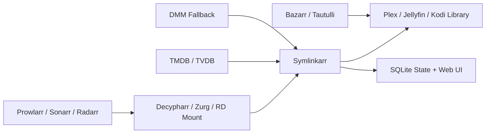

# Symlinkarr


Symlinkarr manages symlinks between a Real-Debrid-backed source and your media library.

> The last-mile library layer for debrid + *arr + Plex/Jellyfin setups.

It is built for setups where Sonarr, Radarr, Prowlarr, Decypharr, Zurg, Plex, and similar tools already exist, but the final library still needs a reliable layer that can:

- match the right movie or episode
- create stable symlinks with clean names
- keep track of dead, stale, or duplicated links
- repair or reacquire missing content without manual folder surgery

## What Symlinkarr Solves

Symlinkarr is meant to fix the messy last mile in a debrid + media-server stack.

Common problems it addresses:

- wrong matches from noisy release names
- dead symlinks after RD content disappears or moves
- duplicate/manual links left behind from older tooling
- libraries that drift away from Sonarr/Radarr tracking
- large RD libraries that are too slow or too rate-limited to rescan naively
- anime numbering and naming mismatches that ordinary TV matching handles poorly

In practice, it gives you a cleaner Plex/Jellyfin/Kodi-facing library without needing to manually babysit the symlink layer.

## Integrates With

Symlinkarr can interact with:

- Real-Debrid mounts from tools like Zurg, Decypharr, and similar providers
- Plex, Jellyfin, or Kodi-style library folders
- Sonarr
- Radarr
- Prowlarr
- Bazarr
- Tautulli
- TMDB
- TVDB
- Debrid Media Manager

It uses TVDB/TMDB-tagged library folders such as `{tvdb-123456}` or `{tmdb-123456}` to keep matching deterministic and safe.

## Typical Stack

You do not need every service below, but this is the kind of stack Symlinkarr is designed to sit inside:



Typical example:

- Sonarr and Radarr decide what should exist in your library
- Prowlarr and Decypharr help acquire or expose that content through your RD mount
- Symlinkarr scans the mount, matches the right files, and writes clean symlinks into your media library
- Plex or Jellyfin sees only the clean library paths, not the messy source filenames
- The built-in web UI gives you scan telemetry, cleanup review, and dead-link visibility

## How It Works

At a high level, Symlinkarr does four things:

1. scans your library folders and reads the `{tvdb-*}` / `{tmdb-*}` identity tags
2. scans your RD-backed source and parses the actual files that exist
3. matches source files to the right movie or episode using metadata, aliases, and safety checks
4. writes or updates clean symlinks in your library and records the result in SQLite

That gives you a stable library view even when the underlying source names are noisy, inconsistent, or temporary.

## Quick Start

### What You Need

- a Real-Debrid mount that exposes your files on disk
- a library folder structure for movies and/or series
- a config file based on [config.example.yaml](config.example.yaml)
- TMDB and TVDB keys if you want full metadata-driven matching
- Docker if you want the container path, or Rust/Cargo if you want to run locally

### Docker

1. Copy [config.example.yaml](config.example.yaml) to `config.docker.yaml` and adjust paths, tokens, and URLs.
2. Make sure the mounts in [docker-compose.yml](docker-compose.yml) match your actual Plex and RD paths.
3. Start it:

```bash
docker-compose up -d
```

The provided compose file runs:

```text
symlinkarr --config /app/config/config.yaml daemon
```

If `web.enabled: true` is set in config, the web UI starts alongside daemon mode.

If you want to reach the web UI from the host while using Docker, add a port mapping for `8726` in `docker-compose.yml`.

### Local / Host Run

Build and run:

```bash
cargo build --release
cargo run -- scan --dry-run
```

Run the web UI only:

```bash
cargo run -- web
```

Default local URL:

```text
http://127.0.0.1:8726
```

Native Windows is not currently supported. On Windows 11, run Symlinkarr through WSL2 or a Linux container.

### Windows 11 Development via WSL2

If you want to keep developing on a Windows 11 laptop, use `WSL2` as the actual Symlinkarr environment.

Recommended setup:

- install Ubuntu under `WSL2`
- keep the repo on the Linux side, for example `~/apps/Symlinkarr`
- do not develop from `/mnt/c/...`; symlink and file-watch behavior is worse there
- run Rust, SQLite, Docker, and Symlinkarr commands inside WSL
- optionally use VS Code with Remote WSL as the editor

Fast path:

```bash
sudo apt update
sudo apt install -y build-essential pkg-config libssl-dev sqlite3 git curl
curl https://sh.rustup.rs -sSf | sh
source "$HOME/.cargo/env"
mkdir -p ~/apps
cd ~/apps
git clone <YOUR-REPO-URL> Symlinkarr
cd Symlinkarr
cargo test --quiet
cargo run -- web
```

There is a fuller checklist in [docs/DEV_SETUP_WSL.md](docs/DEV_SETUP_WSL.md).

### Minimal First Run

Validate config:

```bash
symlinkarr config validate
symlinkarr doctor
```

Preview matches without writing links:

```bash
symlinkarr scan --dry-run
```

Run a real scan:

```bash
symlinkarr scan
```

## Configuration

Important files:

- [config.example.yaml](config.example.yaml): starting template
- `config.yaml`: typical local-host config
- `config.docker.yaml`: typical container config
- `.env` / `.env.local`: optional local secret loading

Symlinkarr supports:

- `env:VAR` secrets
- `secretfile:/path/to/file` secrets
- local SQLite state in `db_path`
- optional web UI via:

```yaml
web:
  enabled: true
  bind_address: "127.0.0.1"
  port: 8726
```

Use `bind_address: "0.0.0.0"` only when you explicitly want to expose the web UI beyond loopback, for example inside Docker with a published port.

Optional Plex refresh hardening:

```yaml
plex:
  url: "http://localhost:32400"
  token: "env:SYMLINKARR_PLEX_TOKEN"
  refresh_enabled: true
  refresh_delay_ms: 250
  refresh_coalesce_threshold: 8
  max_refresh_batches_per_run: 12
```

If Plex becomes unstable under refresh load, raise `refresh_delay_ms`, lower `max_refresh_batches_per_run`, or temporarily set `refresh_enabled: false`.

When `--config` is omitted, Symlinkarr searches:

1. `SYMLINKARR_CONFIG`
2. `./config.yaml`
3. `/app/config/config.yaml`

## Common Commands

Scan and link:

```bash
symlinkarr scan --dry-run
symlinkarr scan
symlinkarr scan --library Anime --search-missing
```

Start long-running daemon mode:

```bash
symlinkarr daemon
```

Run the web UI only:

```bash
symlinkarr web
symlinkarr web --port 9999
```

Inspect health and status:

```bash
symlinkarr status --health
symlinkarr doctor --output json
symlinkarr report --plex-db "/var/lib/plex/Plex Media Server/Plug-in Support/Databases/com.plexapp.plugins.library.db"
symlinkarr report --library Anime --plex-db "/var/lib/plex/Plex Media Server/Plug-in Support/Databases/com.plexapp.plugins.library.db" --full-anime-duplicates --output json --pretty
```

For Plex drift analysis, treat Plex `deleted_at` as a hint, not as truth. Symlinkarr only considers `Plex deleted + known missing source` to be a strong removal signal, which protects against mass false deletes when Plex scans while the RD mount is temporarily down.
For anime remediation exports, `--full-anime-duplicates` disables the default sample cap so the report contains the full backlog of mixed legacy roots and correlated Hama AniDB/TVDB split groups.

Manage auto-acquire queue:

```bash
symlinkarr queue list
symlinkarr queue retry --scope failed
```

Cleanup workflow:

```bash
symlinkarr cleanup audit --scope anime
symlinkarr cleanup prune --report backups/cleanup-audit-anime-YYYYMMDD-HHMMSS.json
symlinkarr cleanup prune --report backups/cleanup-audit-anime-YYYYMMDD-HHMMSS.json --include-legacy-anime-roots
symlinkarr cleanup prune --report backups/cleanup-audit-anime-YYYYMMDD-HHMMSS.json --apply --confirm-token <TOKEN>
```

`--include-legacy-anime-roots` is an explicit opt-in for warning-only anime findings where a legacy untagged root coexists with a tagged `{tvdb-*}` or `{tmdb-*}` root. Those candidates stay `foreign` and are quarantined rather than deleted.
Destructive cleanup commands also stop early if a configured source mount is unhealthy, so a transient RD outage does not become a cleanup event.

Cache management:

```bash
symlinkarr cache status
symlinkarr cache build
```

Repair and discovery:

```bash
symlinkarr repair scan
symlinkarr repair auto --dry-run
symlinkarr discover list
```

For the full command matrix, see [CLI_MANUAL.md](docs/CLI_MANUAL.md).

## Web UI and API

The built-in web UI exposes:

- dashboard and status pages
- scan history and per-run telemetry
- cleanup audit and prune preview flows
- dead-link review
- JSON API endpoints under `/api/v1`

Current API coverage is documented in [API_SCHEMA.md](docs/API_SCHEMA.md).

## Matching and Safety

Symlinkarr defaults to strict matching behavior.

That means:

- one best candidate per source item
- ambiguous near-ties are rejected
- destination conflicts keep the stronger candidate
- token-boundary title matching is used to avoid bad substring matches
- cleanup and prune are intentionally two-step, with preview before deletion

It also keeps local SQLite state for link records, scan history, queue state, cache data, and operational telemetry.

## FAQ

### Does Symlinkarr replace Sonarr or Radarr?

No. It is designed to complement them.

Sonarr and Radarr still decide what should exist in your library. Symlinkarr handles the final symlink layer between your RD-backed source and your media library.

### Does it download or move media files?

Not in the usual sense.

Symlinkarr primarily scans, matches, links, repairs, and prunes. It can participate in reacquire workflows through tools like Prowlarr, DMM, and Decypharr, but it is not a general-purpose downloader on its own.

### Does it modify the original files in my RD mount?

No. The intended model is that Symlinkarr creates or updates symlinks in your library paths. It does not rewrite the source media files themselves.

### Do I need `{tvdb-*}` or `{tmdb-*}` in folder names?

Yes, if you want the strongest and safest matching behavior.

That is the recommended layout, and it is the model Symlinkarr is built around.

### Can I use it without Docker?

Yes.

You can run it directly with Cargo or the compiled binary:

```bash
cargo run -- scan --dry-run
cargo run -- web
```

On Windows 11, use WSL2 or Docker rather than a native Windows build.

### Is there a web UI?

Yes.

Run:

```bash
symlinkarr web
```

Then open:

```text
http://127.0.0.1:8726
```

## Advanced Docs

If you want the deeper implementation or operator docs, start here:

- [CLI_MANUAL.md](docs/CLI_MANUAL.md)
- [API_SCHEMA.md](docs/API_SCHEMA.md)
- [RD_DMM_FILE_RESOLUTION_SPEC.md](docs/RD_DMM_FILE_RESOLUTION_SPEC.md)
- [ANIME_LISTS_INTEGRATION_SPEC.md](docs/ANIME_LISTS_INTEGRATION_SPEC.md)
- [DEV_SETUP_WSL.md](docs/DEV_SETUP_WSL.md)
- [DESIGN_COUNCIL_ROADMAP.md](docs/DESIGN_COUNCIL_ROADMAP.md)
- [CHANGELOG.md](docs/CHANGELOG.md)
