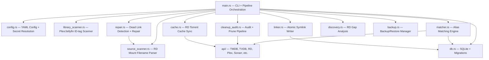

# Symlinkarr Code Review — 2026-03-14

Full deep-dive review of the Symlinkarr codebase (~15,000 lines of Rust across 16 source modules + 12 API clients).

---

## Overall Architecture Assessment

> [!TIP]
> **Verdict: Production-quality codebase with mature engineering patterns.** The code is well-structured, defensively written, and demonstrates strong operational awareness. Most findings below are refinement-level improvements, not fundamental issues.

---

## ✅ Strengths

### 1. Safety-First Symlink Operations
The codebase has **multiple layers of protection** against destructive operations on non-symlink targets:
- [linker.rs:222–304](file:///home/lenny/apps/Symlinkarr/src/linker.rs#L222-L304) — Directory guard, regular-file guard, symlink-only enforcement
- [repair.rs:37–54](file:///home/lenny/apps/Symlinkarr/src/repair.rs#L37-L54) — [assert_symlink_only()](file:///home/lenny/apps/Symlinkarr/src/repair.rs#34-55) safety gate
- [linker.rs:345–371](file:///home/lenny/apps/Symlinkarr/src/linker.rs#L345-L371) — Atomic temp-file + rename pattern (M-11)
- [linker.rs:345–371](file:///home/lenny/apps/Symlinkarr/src/linker.rs#L345-L371) — DB transaction wraps FS writes (C-01)

### 2. Robust Configuration System
- Supports `env:VAR` and `secretfile:/path` indirection for secrets
- .env file loading with `export` prefix support, non-overwrite semantics, and quoted value parsing
- Legacy alias migration (`backup.dir` → `backup.path`)
- Comprehensive validation with structured [ValidationReport](file:///home/lenny/apps/Symlinkarr/src/config.rs#173-177)

### 3. Well-Designed Matching Engine
- Token-index prefilter avoids O(n²) library×source comparisons
- Configurable matching modes (Strict/Balanced/Aggressive) with tuned thresholds
- Ambiguity detection prevents false matches
- Deterministic destination-slot deduplication with quality+score tiebreaking
- Anime absolute-to-seasonal episode mapping with cumulative episode resolution

### 4. Solid Database Layer
- Transactional migrations (crash-safe, re-runnable)
- WAL mode + busy_timeout for concurrent CLI/daemon access
- Legacy schema inference for seamless upgrades
- File permissions set to `0o600` on creation

### 5. Excellent Test Coverage
Every module has inline `#[cfg(test)]` tests. Notable: matcher ambiguity tests, config secret resolution, backup restore roundtrip, anime episode mapping, DB migration up/down testing.

---

## 🔍 Findings

### Critical (0)
No critical bugs found.

---

### High Priority (3)

#### H-1. [discovery.rs](file:///home/lenny/apps/Symlinkarr/src/discovery.rs) has its own [normalize()](file:///home/lenny/apps/Symlinkarr/src/utils.rs#93-111) that differs from `utils::normalize()`

| File | Line |
|------|------|
| [discovery.rs:147–156](file:///home/lenny/apps/Symlinkarr/src/discovery.rs#L147-L156) | Private [normalize()](file:///home/lenny/apps/Symlinkarr/src/utils.rs#93-111) |
| [utils.rs:95–110](file:///home/lenny/apps/Symlinkarr/src/utils.rs#L95-L110) | `pub normalize()` with NFC |

The discovery module defines its own [normalize()](file:///home/lenny/apps/Symlinkarr/src/utils.rs#93-111) that skips Unicode NFC normalization and substitutes special chars differently (filters them vs replaces with space). This means title comparisons in [find_gaps()](file:///home/lenny/apps/Symlinkarr/src/discovery.rs#31-89) can produce different results than the matcher. **Recommendation:** Reuse `crate::utils::normalize`.

#### H-2. Duplicated [cached_source_exists()](file:///home/lenny/apps/Symlinkarr/src/linker.rs#699-726) and [path_under_roots()](file:///home/lenny/apps/Symlinkarr/src/linker.rs#695-698)

Both [linker.rs](file:///home/lenny/apps/Symlinkarr/src/linker.rs) and [repair.rs](file:///home/lenny/apps/Symlinkarr/src/repair.rs) have their own copies of [cached_source_exists()](file:///home/lenny/apps/Symlinkarr/src/linker.rs#699-726) and [path_under_roots()](file:///home/lenny/apps/Symlinkarr/src/linker.rs#695-698). The implementations are functionally identical but maintained separately.

| Function | Locations |
|----------|-----------|
| [cached_source_exists](file:///home/lenny/apps/Symlinkarr/src/linker.rs#699-726) | [linker.rs:699–725](file:///home/lenny/apps/Symlinkarr/src/linker.rs#L699-L725), [repair.rs:73–101](file:///home/lenny/apps/Symlinkarr/src/repair.rs#L73-L101) |
| [path_under_roots](file:///home/lenny/apps/Symlinkarr/src/linker.rs#695-698) | [linker.rs:695](file:///home/lenny/apps/Symlinkarr/src/linker.rs#L695), [repair.rs:69](file:///home/lenny/apps/Symlinkarr/src/repair.rs#L69), [backup.rs:474](file:///home/lenny/apps/Symlinkarr/src/backup.rs#L474) |

**Recommendation:** Move to [utils.rs](file:///home/lenny/apps/Symlinkarr/src/utils.rs).

#### H-3. `VIDEO_EXTENSIONS` is defined twice

The constant is duplicated in [source_scanner.rs:67–69](file:///home/lenny/apps/Symlinkarr/src/source_scanner.rs#L67-L69) and [repair.rs:20–22](file:///home/lenny/apps/Symlinkarr/src/repair.rs#L20-L22).

**Recommendation:** Move to a shared location (e.g., [models.rs](file:///home/lenny/apps/Symlinkarr/src/models.rs) or [utils.rs](file:///home/lenny/apps/Symlinkarr/src/utils.rs)).

---

### Medium Priority (7)

#### M-1. [main.rs](file:///home/lenny/apps/Symlinkarr/src/main.rs) is 2641 lines — consider splitting

The file handles CLI arg defs, all subcommand dispatch logic, daemon loop, helper functions, and tests. A typical refactor would extract subcommand handlers into a `commands/` module.

#### M-2. [linker.rs](file:///home/lenny/apps/Symlinkarr/src/linker.rs) — dry-run reports `Created`/`Updated` outcomes but logs events as `"skipped"`

At [linker.rs:307–328](file:///home/lenny/apps/Symlinkarr/src/linker.rs#L307-L328), dry-run creates a `LinkWriteOutcome::Created` but logs a `"skipped"` event with note `"dry_run"`. This creates confusing audit trail — the link_event says "skipped" but the scan summary says "created".

**Recommendation:** Use a distinct event action like `"dry_run_created"` / `"dry_run_updated"`.

#### M-3. [repair.rs](file:///home/lenny/apps/Symlinkarr/src/repair.rs) — [find_dead_links()](file:///home/lenny/apps/Symlinkarr/src/repair.rs#425-479) does filesystem stat on `original_source` for every dead link

At [repair.rs:470](file:///home/lenny/apps/Symlinkarr/src/repair.rs#L470), `std::fs::metadata(&record.source_path)` is called per dead link without any caching. For large libraries on slow FUSE mounts, this could stall significantly.

**Recommendation:** Apply the same [cached_source_exists](file:///home/lenny/apps/Symlinkarr/src/linker.rs#699-726) pattern used elsewhere, or defer the size lookup.

#### M-4. [config.rs](file:///home/lenny/apps/Symlinkarr/src/config.rs) — [load_dotenv_file](file:///home/lenny/apps/Symlinkarr/src/config.rs#1132-1170) uses `std::env::set_var` (unsafe in Rust 2024+)

At [config.rs:1164](file:///home/lenny/apps/Symlinkarr/src/config.rs#L1164), `set_var` is called in a loop. As of Rust edition 2024, this is flagged as unsafe because it's not thread-safe. The [env_lock()](file:///home/lenny/apps/Symlinkarr/src/config.rs#1425-1429) mutex in tests shows awareness of this, but the production code path has no such guard.

**Recommendation:** Use the `unsafe { std::env::set_var(...) }` block (Rust 2024) or switch to a `HashMap`-based env overlay that doesn't mutate the process environment.

#### M-5. [source_scanner.rs](file:///home/lenny/apps/Symlinkarr/src/source_scanner.rs) — year extracted hardcoded to `1900..=2030`

At [source_scanner.rs:337](file:///home/lenny/apps/Symlinkarr/src/source_scanner.rs#L337), [(1900..=2030).contains(&year)](file:///home/lenny/apps/Symlinkarr/src/backup.rs#456-472) means files from 2031+ will be misparsed. This should be dynamic (e.g., `current_year + 5`).

#### M-6. Parallel [match_source_slice](file:///home/lenny/apps/Symlinkarr/src/matcher.rs#905-1075) only triggered at ≥10,000 source items

At [matcher.rs:248–251](file:///home/lenny/apps/Symlinkarr/src/matcher.rs#L248-L251), the parallelization threshold is 10k. For libraries with ~5k source files and ~2k library items, this still runs single-threaded. Consider lowering to ~2,000 or making it configurable.

#### M-7. [backup.rs](file:///home/lenny/apps/Symlinkarr/src/backup.rs) — [rotate_by_prefix](file:///home/lenny/apps/Symlinkarr/src/backup.rs#359-389) uses `Vec::remove(0)` in a loop

At [backup.rs:383](file:///home/lenny/apps/Symlinkarr/src/backup.rs#L383), `files.remove(0)` is O(n) per call. For typical backup counts (3–10) this is negligible, but a `VecDeque` or reverse iteration would be cleaner.

---

### Low Priority / Style (5)

#### L-1. Several `#[allow(dead_code)]` annotations could be cleaned up
Files like [repair.rs](file:///home/lenny/apps/Symlinkarr/src/repair.rs) have many `#[allow(dead_code)]` on struct fields tagged "Diagnostic context" or "Context for repair report". If these fields are truly only for `Debug` output, consider removing them or gating behind a `verbose` feature.

#### L-2. [discovery.rs](file:///home/lenny/apps/Symlinkarr/src/discovery.rs) — string [truncate()](file:///home/lenny/apps/Symlinkarr/src/discovery.rs#167-175) slices at byte index without char boundary check
At [discovery.rs:172](file:///home/lenny/apps/Symlinkarr/src/discovery.rs#L172), `&s[..max_len - 1]` can panic on multi-byte UTF-8. The [linker.rs](file:///home/lenny/apps/Symlinkarr/src/linker.rs) version ([truncate_str_bytes](file:///home/lenny/apps/Symlinkarr/src/linker.rs#727-739)) correctly handles this.

#### L-3. [cleanup_audit.rs](file:///home/lenny/apps/Symlinkarr/src/cleanup_audit.rs) — metadata loading is sequential
Unlike [matcher.rs](file:///home/lenny/apps/Symlinkarr/src/matcher.rs) which uses a `JoinSet` with a semaphore for parallel metadata fetches, [cleanup_audit.rs](file:///home/lenny/apps/Symlinkarr/src/cleanup_audit.rs) loads metadata sequentially at [cleanup_audit.rs:451](file:///home/lenny/apps/Symlinkarr/src/cleanup_audit.rs#L451). For large anime libraries this could be slow.

#### L-4. [api/http.rs](file:///home/lenny/apps/Symlinkarr/src/api/http.rs) — TMDB and TVDB share one rate gate
At [http.rs:32](file:///home/lenny/apps/Symlinkarr/src/api/http.rs#L32), both `themoviedb.org` and `thetvdb.com` share the `TMDB_RATE_GATE`. They have different rate limits in practice. Separate gates would allow better throughput.

#### L-5. [linker.rs](file:///home/lenny/apps/Symlinkarr/src/linker.rs) — non-Unix platform has no symlink creation path
The `#[cfg(unix)]` block at [linker.rs:362–369](file:///home/lenny/apps/Symlinkarr/src/linker.rs#L362-L369) means on non-Unix platforms, the code path falls through with no symlink created but the DB transaction still commits and the outcome reports success. This is unlikely to matter in practice (the tool is Linux-targeted) but the compile-time expectation isn't enforced.

---

## 📊 Codebase Statistics

| Module | Lines | Role |
|--------|------:|------|
| [main.rs](file:///home/lenny/apps/Symlinkarr/src/main.rs) | 2,641 | CLI + subcommand dispatch |
| [config.rs](file:///home/lenny/apps/Symlinkarr/src/config.rs) | 1,969 | Config loading, validation, secrets |
| [db.rs](file:///home/lenny/apps/Symlinkarr/src/db.rs) | 2,208 | SQLite persistence + migrations |
| [repair.rs](file:///home/lenny/apps/Symlinkarr/src/repair.rs) | 1,876 | Dead link detection + repair |
| [cleanup_audit.rs](file:///home/lenny/apps/Symlinkarr/src/cleanup_audit.rs) | 1,802 | Audit pipeline + prune |
| [matcher.rs](file:///home/lenny/apps/Symlinkarr/src/matcher.rs) | 1,460 | Matching engine |
| [linker.rs](file:///home/lenny/apps/Symlinkarr/src/linker.rs) | 1,187 | Symlink creation + dead link scan |
| [source_scanner.rs](file:///home/lenny/apps/Symlinkarr/src/source_scanner.rs) | 871 | RD mount parser (standard + anime) |
| [backup.rs](file:///home/lenny/apps/Symlinkarr/src/backup.rs) | 831 | Backup/restore management |
| [cache.rs](file:///home/lenny/apps/Symlinkarr/src/cache.rs) | 343 | RD torrent cache sync |
| [discovery.rs](file:///home/lenny/apps/Symlinkarr/src/discovery.rs) | 225 | RD gap analysis |
| [utils.rs](file:///home/lenny/apps/Symlinkarr/src/utils.rs) | 218 | Normalize, path health, progress |
| [library_scanner.rs](file:///home/lenny/apps/Symlinkarr/src/library_scanner.rs) | 186 | Plex library folder scanner |
| [models.rs](file:///home/lenny/apps/Symlinkarr/src/models.rs) | 175 | Core data structures |
| [api/http.rs](file:///home/lenny/apps/Symlinkarr/src/api/http.rs) | 161 | HTTP retry + rate limiting |
| [api/mod.rs](file:///home/lenny/apps/Symlinkarr/src/api/mod.rs) | 13 | Module declarations |
| **Total** | **~16,166** | |

---

## 🎯 Recommended Priority Actions

1. **Deduplicate shared utilities** (H-2, H-3) — [cached_source_exists](file:///home/lenny/apps/Symlinkarr/src/linker.rs#699-726), [path_under_roots](file:///home/lenny/apps/Symlinkarr/src/linker.rs#695-698), `VIDEO_EXTENSIONS` → [utils.rs](file:///home/lenny/apps/Symlinkarr/src/utils.rs)
2. **Fix [discovery.rs](file:///home/lenny/apps/Symlinkarr/src/discovery.rs) normalize divergence** (H-1) — use `crate::utils::normalize`
3. **Fix [discovery.rs](file:///home/lenny/apps/Symlinkarr/src/discovery.rs) truncate UTF-8 safety** (L-2) — reuse [truncate_str_bytes](file:///home/lenny/apps/Symlinkarr/src/linker.rs#727-739)
4. **Update year range** (M-5) — make dynamic
5. **Split [main.rs](file:///home/lenny/apps/Symlinkarr/src/main.rs)** (M-1) — extract subcommand handlers to `commands/` module when convenient
